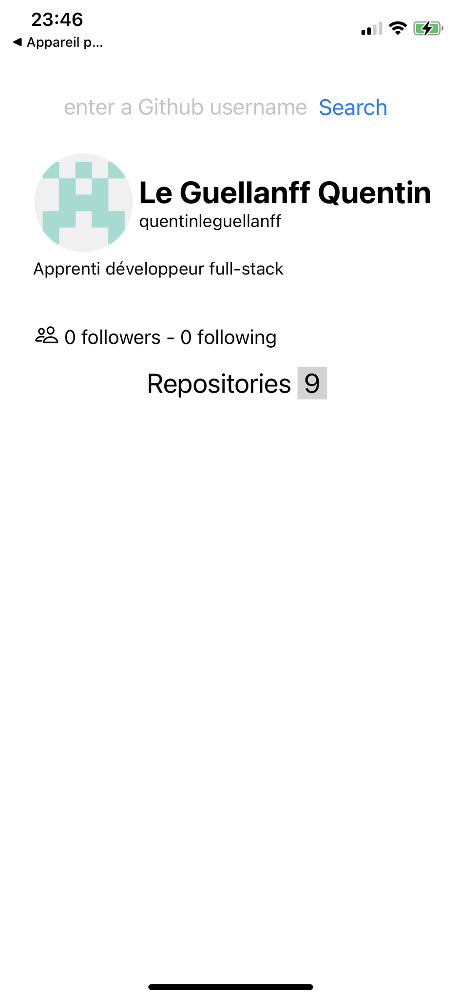

# Search in github

## how to run the project ?
    
    $ cd server/docker
    $ docker-compose up

follow the **.env-dist** to allow your server to the database launched with docker

    $ cd server
    $ npm install
    $ npm run dev

download ngrok :

    $ ./ngrock http 4242

you have to put your ngrok link into the client fetch function, I had some issues with the .env file

    $ cd client
    $ npm install
    $ npm start

## Preview

